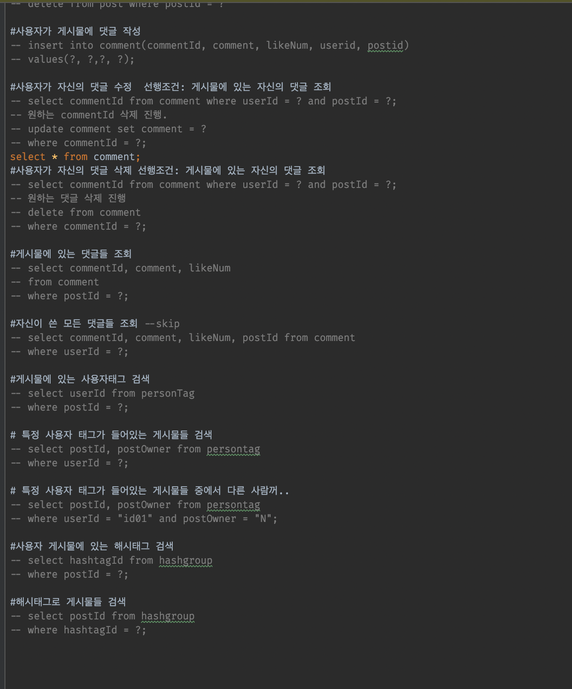
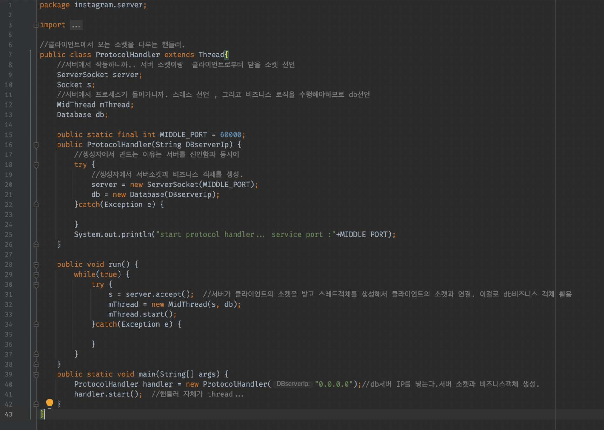

# instagram_project

## Spring 없이 Java로 RestAPI 구현하는 프로젝트

### 데이터 모델링
- 좋아요, 유저, 팔로우, 포스트, 태그, 해시태그, 댓글 등 서로 연관성이 높은 부분이 많아 One-To-Many, Many-To-Many 관계를 판단하는 부분에서 상당한 회의 시간을 소비했다.
  
### 아래는 카카오의 오븐으로 프로토타이핑한 화면과 (Left)
### RestAPI 설계과정에서 작성한 interface다. 

### 데이터 핸들링을 계획하는 과정해서 도출해낸 SQL 

### 이 프로젝트에서는 스프링부트를 사용하지 않고 POJO로 구성하였고 instagram.client 패키지의 클라이언트에서 웹소켓으로 연결을 받아 MySQL에 접근하여 데이터를 핸들링하게 했다.

